Денят е неделя. Б е на 16 месеца.

И този път дестинацията е край Асеновград. Наш приятел сподели за параклис Свети Димитър над Асеновата крепост като опция за кратка разходка до място с хубава гледка.

Пътеката до параклиса е доста кратичка около 15-тина минути. За да се сдигне до началото й с кола се подминава Асеновата крепост. На първия почти обратен ляв завой се намира импровизирания паркинг с табела за параклиса. Съвсем в началото отляво се намира и дърво с причудлива форма, наречено „Лирата на Орфей“. 

  

Пътеката позволява използването й от малки, невръстни, наскоро проходили туристи, но за най-сигурно ги дръжте за ръка. Нашият Б изразяваше свръхсамостоятелността си и накрая финишира по нос в прахта. Рев, сополи и успокояване в раницата доведе до обедния сън на Б. Продължи през по-голямата част от разходката, което беше бонус спокойствие за АМ.

Местенцето около параклиса е изключително облагородено за отмора и обяд с хубава гледка. Видяхме поне 3 заслона с маси и пейки както и доста пейки на открито.

  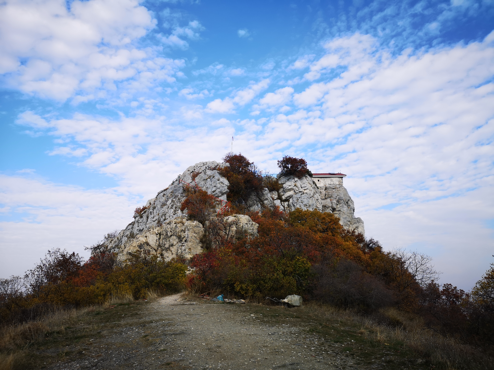

   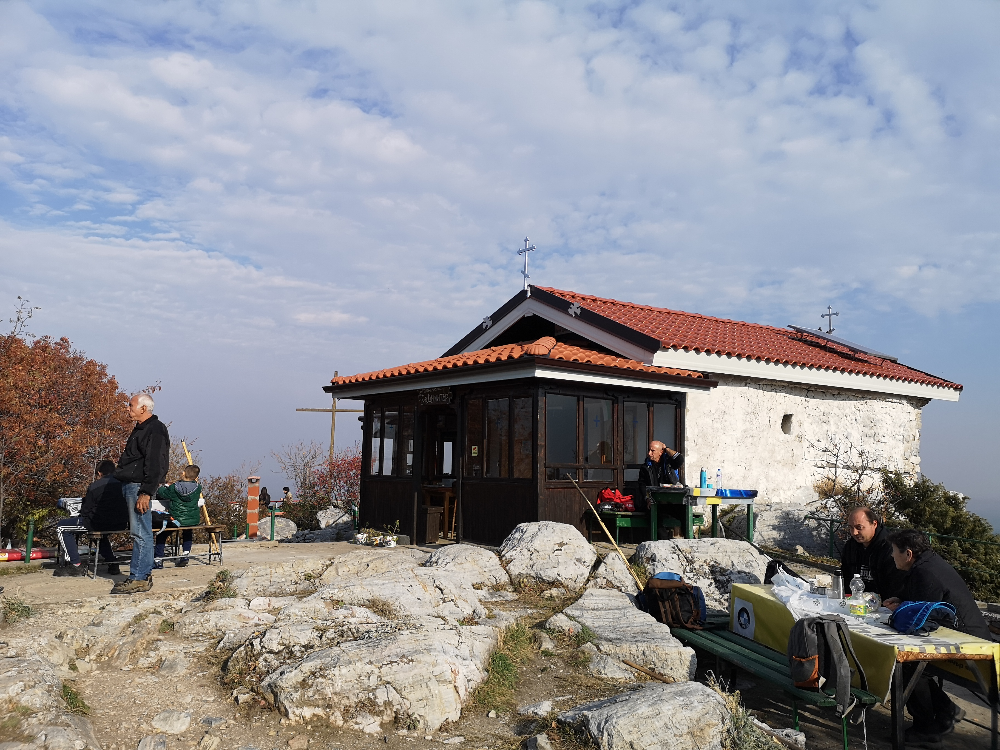

   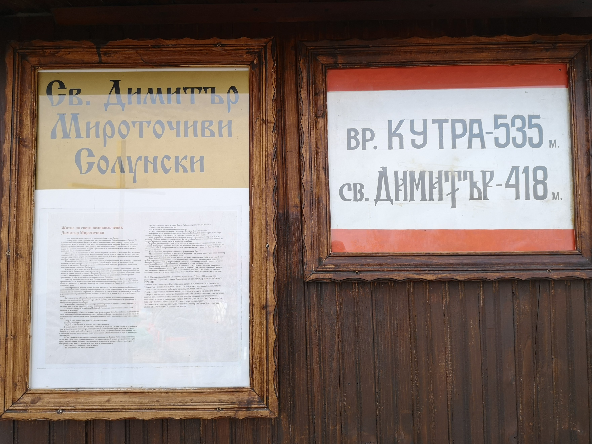

   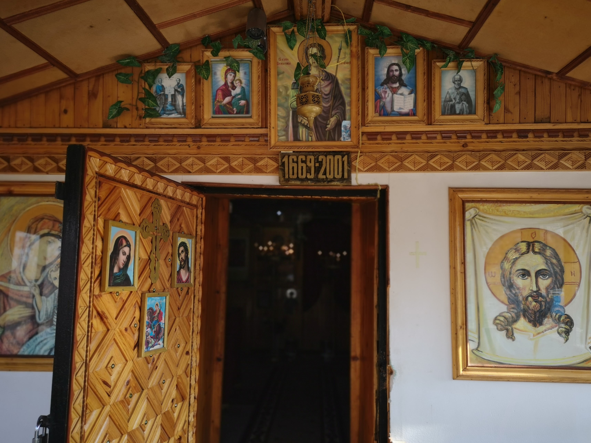

На връщане решихме да се отбием по пътеката за връх Кутра. Приятна горска ненатоварваща пътека с продължителност от 40-тина минути. Пътечката е за по-опитните малки турсти с минимум 3-4 годишен стаж в ходенето. Бебоците ги носим :). Маркировката е бяло-зелено-бяло. Няма къде да се объркате с изключение на едно единствено място, където пътеката тръгва надолу към града покрай информационните табели за растителните и животински видове. Там просто продължете напред през тях, за да излезете на върха. Ние хапнахме горе, любувахме се на гледката, когато „Б“ се събуди и беше негов ред да обядва. Слизането винаги е по-кратко. И този път бяхме удовлетворени от нашата разходка.

   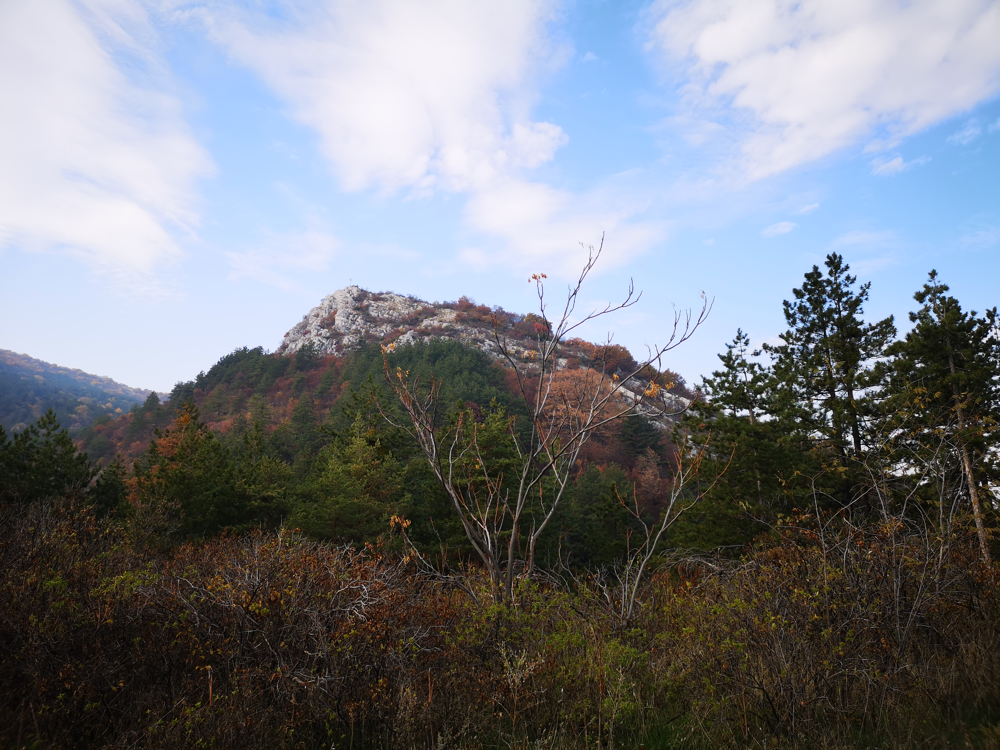

   

   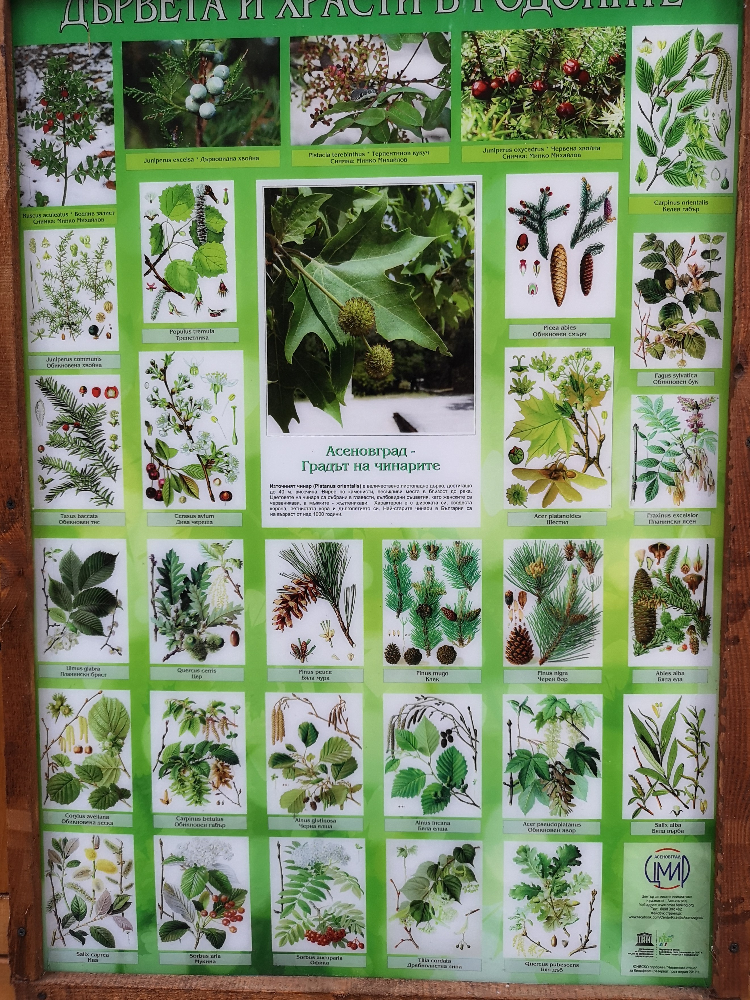

   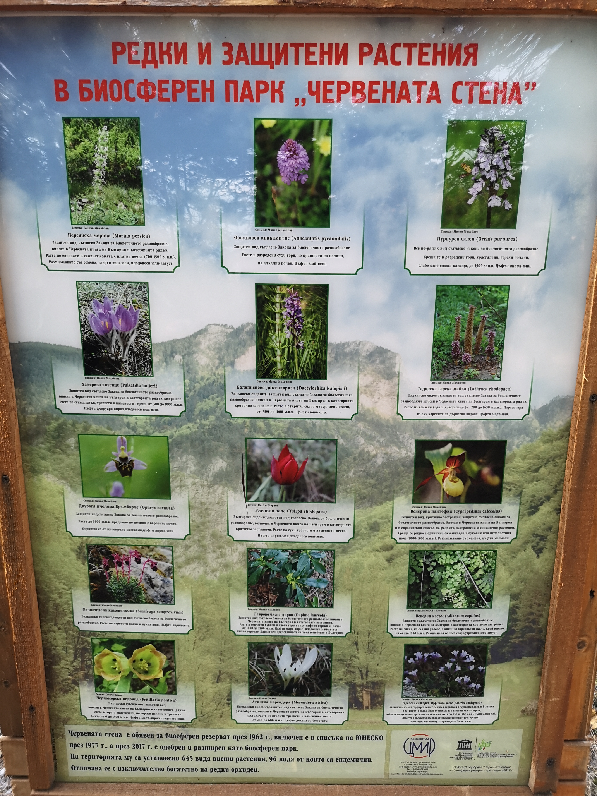

   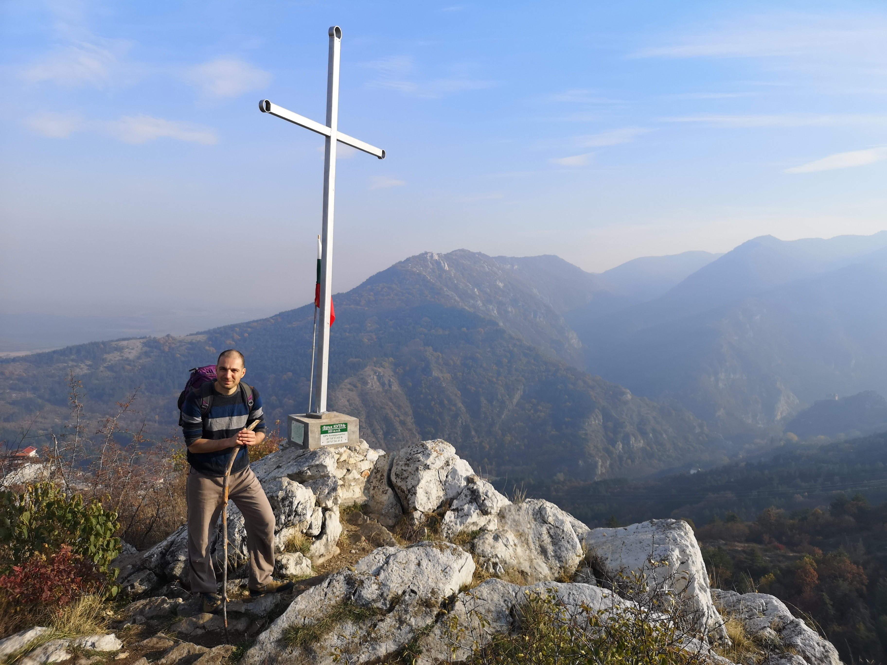

   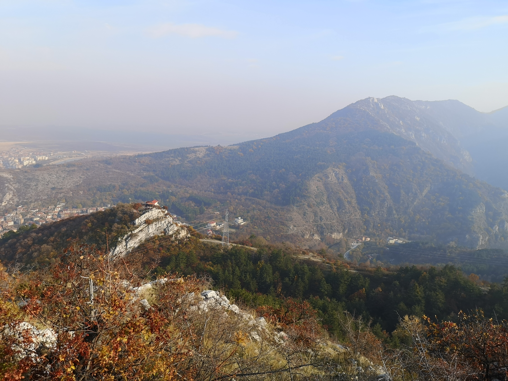

   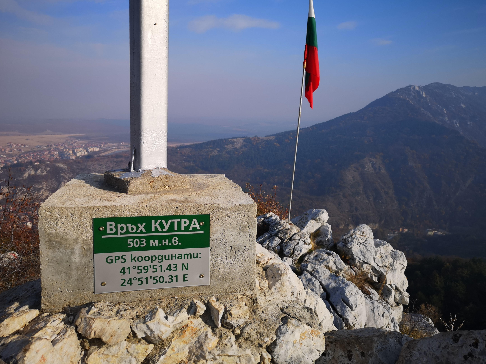

   

   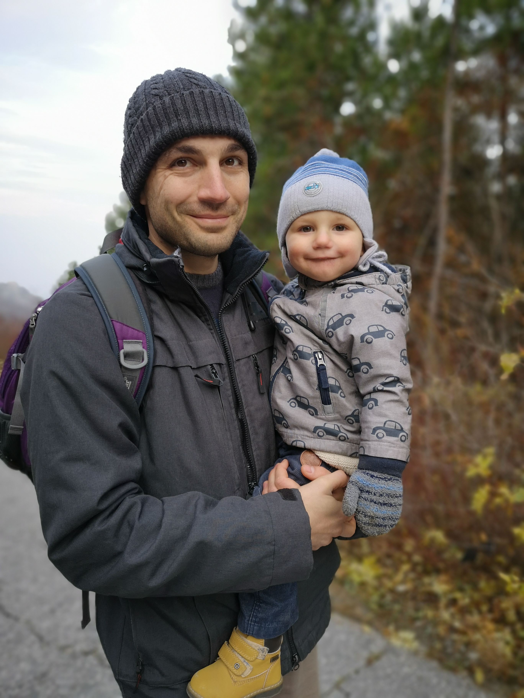

