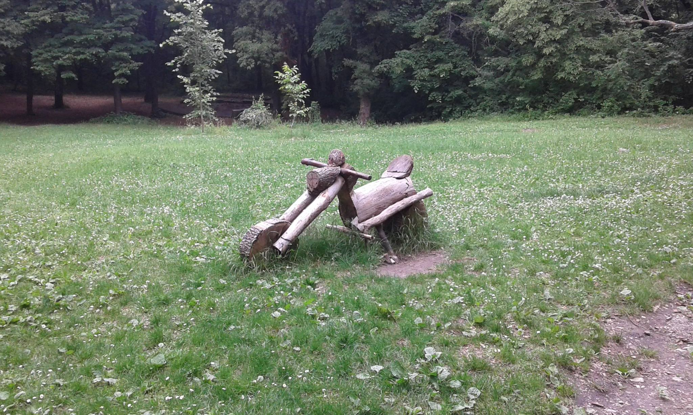
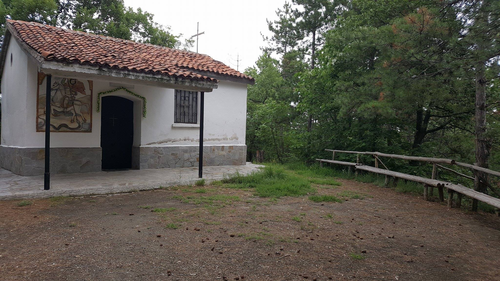

Денят е събота. Б е на 16 месеца. БАМ е с приятели и още един малък приключенец на годинка.

Манчова поляна навярно трябва да е много популярно местенце за жителите на Марково. Поляната е изключително приятно облагородена – навес с пейки и маси, маси и пейки на открито, огнища, сцена в долния ѝ край, люлка, дървени скулптурки на кола и мотор за игра на малките туристи. Всичко това се намира в гората, а шумът от Пловдив е неуловим макар и да се намира само на 10км от него. Поляната се е над вилната зона на Марково, на първия почти обратен ляв завой. Колите могат да се оставят там. Разходката е кратичка 10-15 минути като в началото е подходяща за най-малките, но после си трябва раничка, тъй като има едно кратко слизане. Самата поляна е под лек наклон. На 2 минути от нея се намира параклис Свети Георги, който при нашето ходене беше заключен. 

  

  

Оттам тръгва пътека за параклис Свети Атанас, до който само А стигна,а ние блаженно се препичахме на галещото ноемрвийско слънце. Преходът до там е около 40-50 минути като първо се минава през горичка, а после по черен път през сечище. За параклиса има лека отбивка от пътя и за по-малко от 200 метра сте пред него. Самият път продължава и може би отива до Първомай. Някой ден ще разберем. Разходката по черния път е подходяща за малките пешеходци, но през гората ще им е трудничко. Раничката и този път беше неотменен помощник. Получи се добра разходка.

  

  

  

