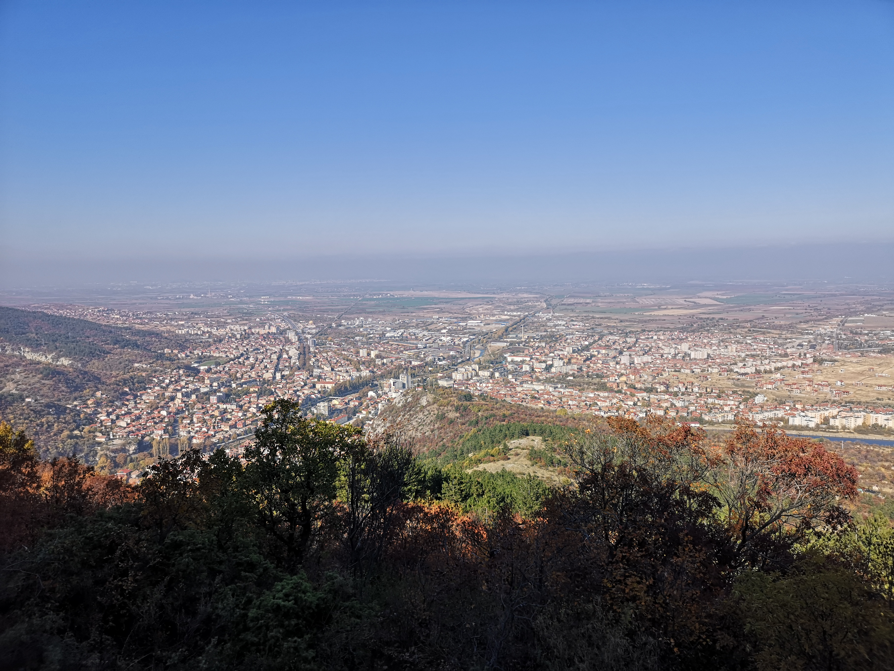
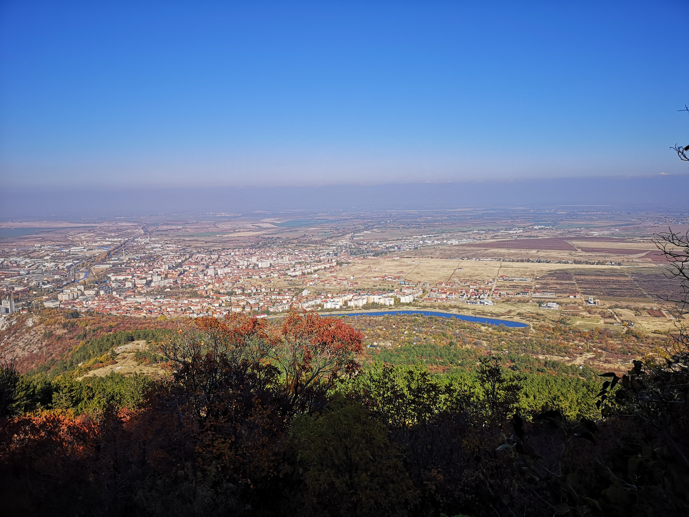
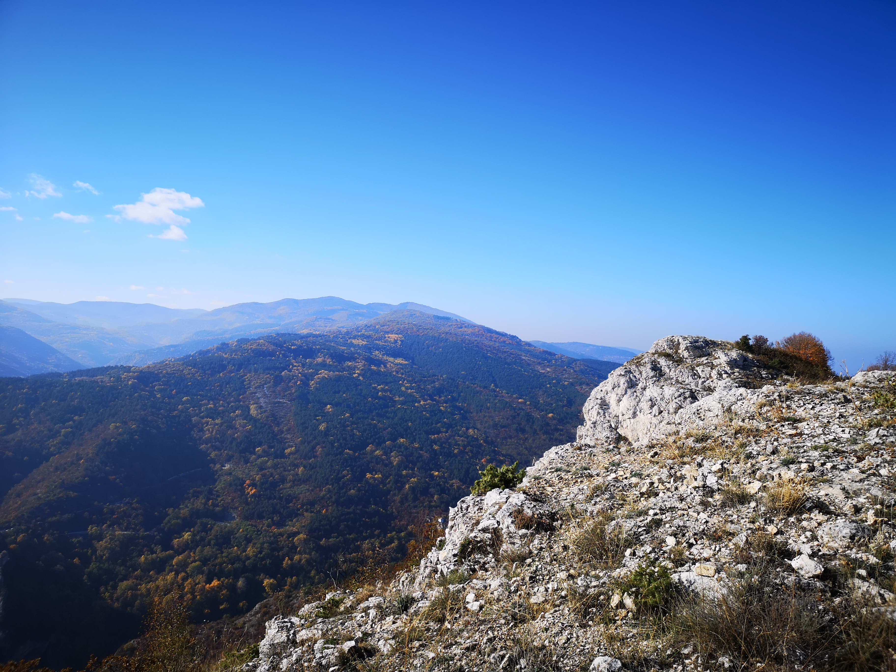
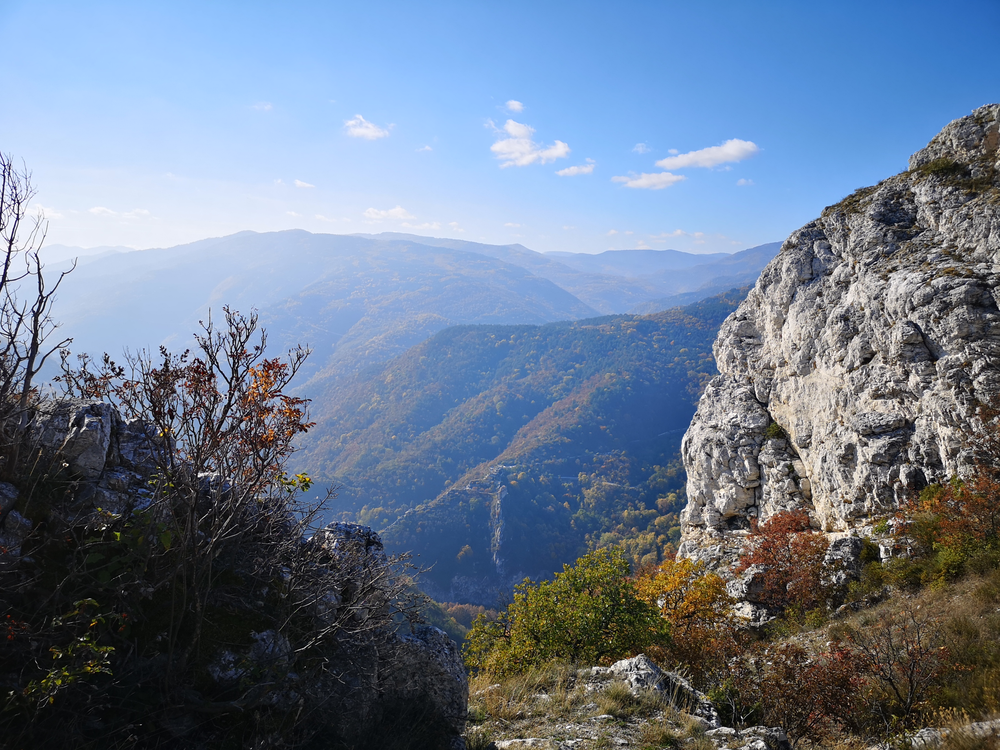
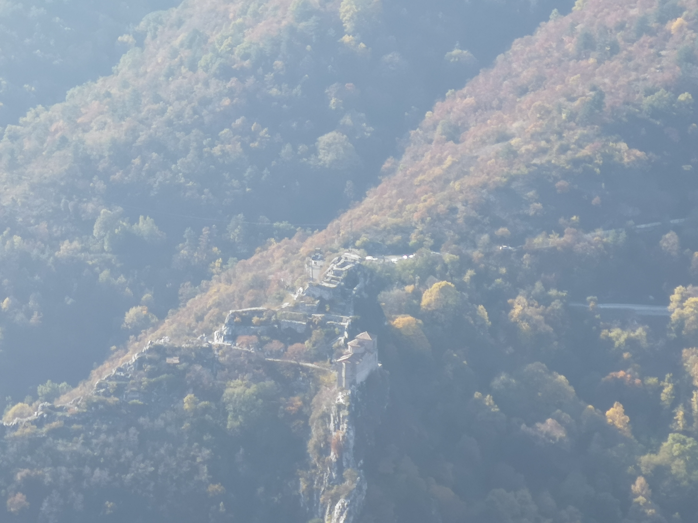
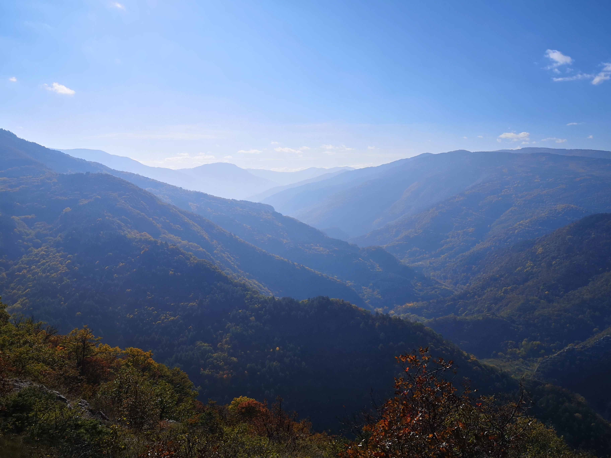
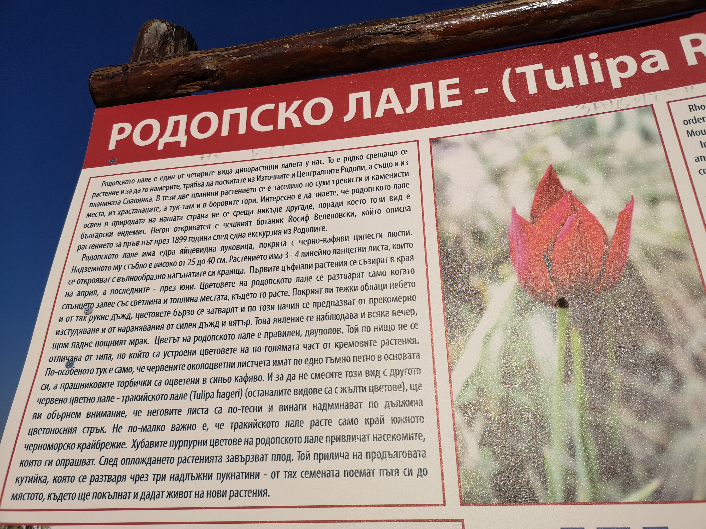
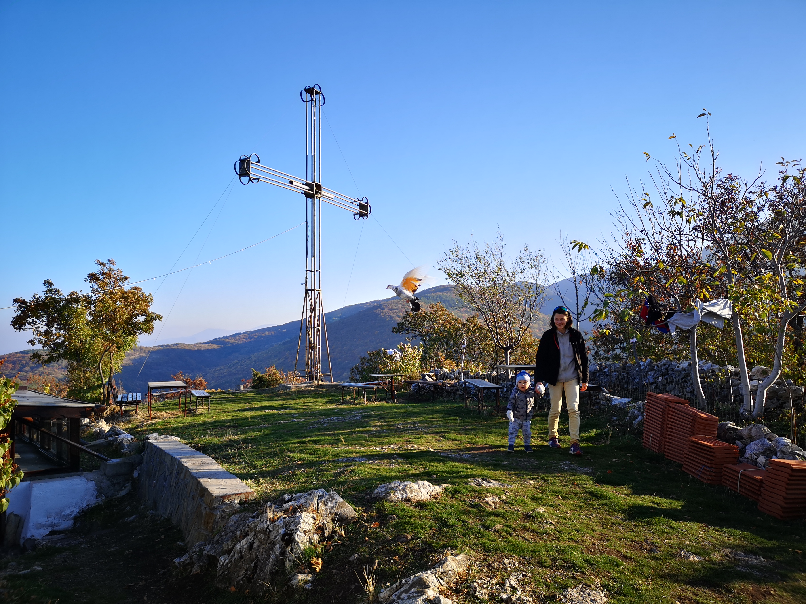
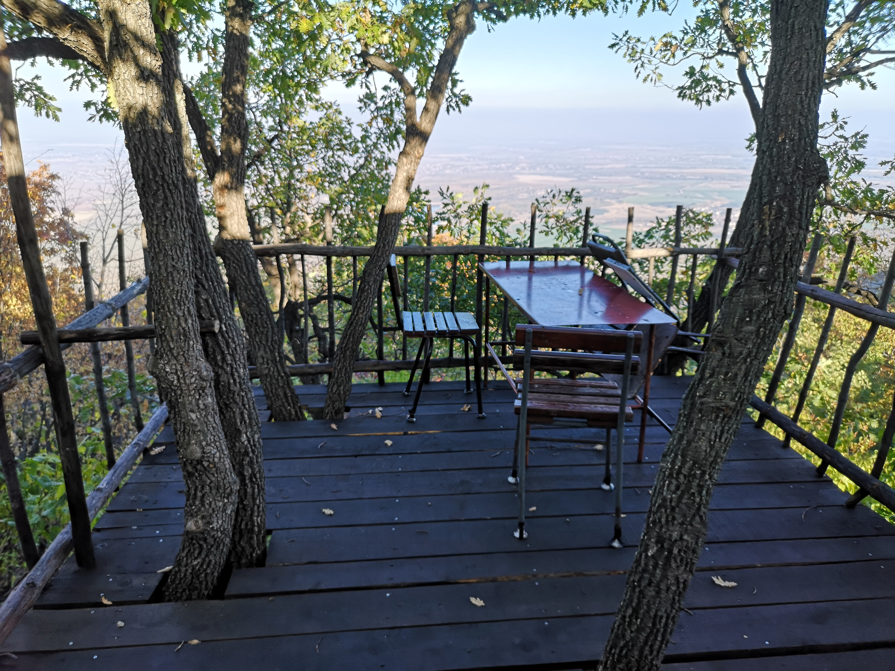
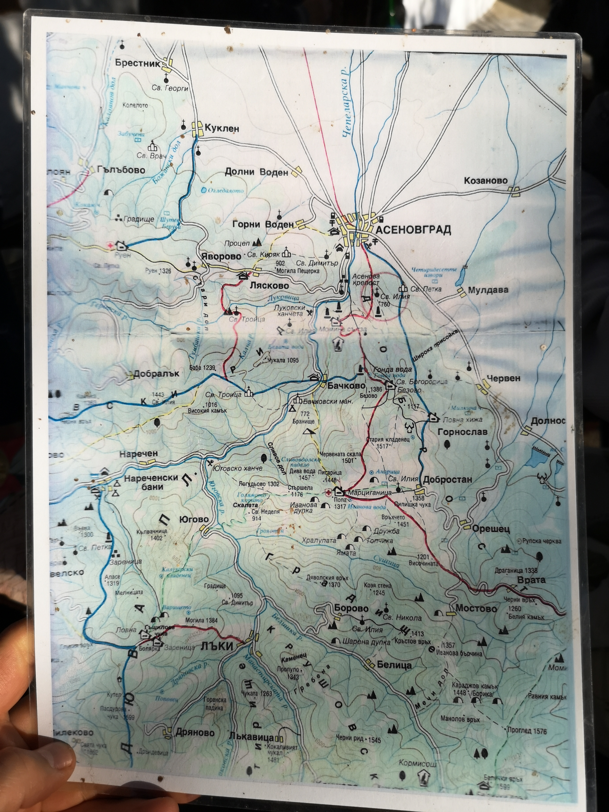

Днес Б навършва 16 месеца. Слънчев есенен ден. Може би един от последните.

Върти се в пространството разходка към връх Анатема и близкоразположеният параклис Св. Илия. Пътепис намерен в Интернет и разказ на познати внасят смут в решителността ни да я осъществим с нашия малък турист. Но ето, че цялата дружина се чувства авантюристично. Поемаме към Асеновград водени от Гугъл мапс към някакво евентуално начало на пътеката без ясна представа дали ще ни отведе на правилното място. Пътят ни води на изхода от Асеновград посока село Червен. След табелата за край на града [се свива по черен път вдясно](https://goo.gl/maps/jXqMiVnhfM6Ce3ND7). Влизаме в Параколово, вилна зона на Асеновград макар и без всякаква пътна инфраструктура. Тук-там има къщи тип вили. Черни пътища се разклоняват на разни посоки. Решихме, че ще оставим колата на голямо уширение и тръгнахме пеш по указанията на Гугъл. Озъртахме се за отклонение от черния път и скоро такова се намери. Видя се пътечка вляво, влизаща в борова гора. Хванахме я и тя се заизкачва нагоре. След по-малко от 20-тина минути излязохме от гората. Нашата пътечка се сля с основната, водеща към параклиса. 

Закрачихме уверено нагоре, а вдясно от нас се появи пейка с гледка към града и низината. Съвсем скоро стигнахме разклонение. И 2-те пътеки водят до параклиса. Вляво се тръгва по полегата пътека директно към него, а вдясно - по стръмна пътека по билото на планината през връх Анатема. Спортният дух направи избора и закрачихме по стръмното. 

  

  

  

Беше обяд и Б унесен в поклащащия ритъм на М, задряма в раничката. Изкачването отне около 40-тина минути без особени почивки. Наклонът не е малък, но е постижимо с бебе отпред( важи за бебеносци със стаж ). Обзе ни усещане за планински преход с търкалящите се камъни по пътеката, изронена от многобройни стъпки. Спящият Б го подсили и за момент се завърнахме в миналото, когато сами кръстосвахме планините. Вълшебно време.

Излязохме на билото и се разкри великолепна гледка. Срещу нас се разгърна Родопа. Долу вдясно разпознахме Асеновата крепост. Зад нас се разтилаше тракийската низина, а Асеновград се побираше в дланите ни. В далечината се мъжделееше Пловдив.

Б още спеше. Какво блаженство.

Кратка почивка, снимки и поехме по билото. Нито изкачването, нито билото са подходящи за малките туристи. Раничката е задължителна. 

  

  

  

  

До параклиса стигнахме за около 35 минути като междувременно Б се събуди и седнахме да хапнем на еднчо за́ветно място под табелата за Родопското лале с гледка към Родопа. Скоро след това стигнахме параклиса. Мястото пленява с великолепната си гледка и не само. Параклисът се поддържа от 90-те години насам. Има 2 закрити беседки. Маси с пейки на открито, дървена тераска с гледка, метален кръст, та дори и слънчеви панели за ток. Там заварихме шумна застаряваща мъжка компания, която пируваше на следобедното слънце. Бяха си изкарали колона и слушаха ту народна, ту поп-фолк музика. Посрещнаха ни с радостни възгласи и ни картотекираха набързо със снимка. Оказа се, че Б е поредното бебе, което го носят до параклиса.

  

  

  

  

  

  

След обиколка на местенцето, любуване на гледки и множество снимки ни поканиха при тях. Единият – Георги – се оказа, че е човекът, който поддържа и се грижи за мястото. Той ни показа подробна карта на района. Сподели, че до параклиса може да се стигне и от Му́лдавския манастир „Св. Петка Му́лдавска“. Разходата от манастира до Св. Илия е 30-тина минути. Компанията ни посъветва да се върнем по полегатата пътека, намираща се под параклиса. Това е всъщност онази полегата пътека от разклонението в началото на нашата разходка.

Да си призная, занапред ще се изкачваме и слизаме само по нея. Много е приятна, ненатоварваща и с чудесна гледка към тракийската низина. Спуснахме се за 40-тина минути като бързахме – на Б вече хич не му се стоеше в раницата. Сладката умора от прекрасната разходка и насъбраните впечатления ни изпълниха с удовлетворение. Ще повторим, потретим, почетвъртим!

Ако сте мераклии за тази разходка, направете я в неделя. Ще имате възможност да се запознаете с веселите „младежи“, бай Георги и Камбата.

  

  

  

